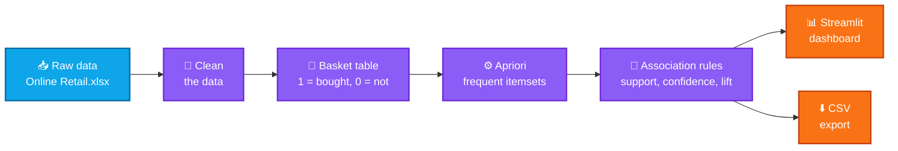

<!-- Before publishing: replace YOUR_USERNAME in the "git clone" command (Run It section). -->

<div align="center">


<br />


<br /><br />

<b>
  <a href="#-what-is-this-project">Overview</a> &nbsp;•&nbsp;
  <a href="#-results-at-a-glance">Results</a> &nbsp;•&nbsp;
  <a href="#-key-terms-in-simple-words">Concepts</a> &nbsp;•&nbsp;
  <a href="#-how-it-works">How It Works</a> &nbsp;•&nbsp;
  <a href="#-dashboard-features">Dashboard</a> &nbsp;•&nbsp;
  <a href="#-run-it-on-your-computer">Run It</a> &nbsp;•&nbsp;
  <a href="#-faq">FAQ</a>
</b>

</div>

## 💡 What Is This Project?

> **You've seen it on every shopping site:** *"Customers who bought this also bought…"*<br />
> This project builds that exact idea from scratch, using real retail data.

**Market Basket Analysis** studies thousands of shopping baskets to discover **which products are usually bought together**. In simple words:

1. 🛒 Take real store invoices
2. 🔍 Find product combinations that appear together often (**Apriori algorithm**)
3. 📏 Score every combination with **support**, **confidence** and **lift**
4. 📊 Explore everything in an **interactive Streamlit dashboard** and export the rules as a CSV file

> [!NOTE]
> This project was developed as part of my internship at **Codec Technologies**.

### 🎯 Project Objectives

- [x] Identify frequently purchased product combinations
- [x] Generate association rules using the Apriori algorithm
- [x] Analyze support, confidence, and lift
- [x] Display insights through a Streamlit dashboard
- [x] Export association rules as a CSV file

## 🏆 Results at a Glance

<div align="center">

<table>
  <tr>
    <td align="center"><h2>16,864</h2>🧾 Transactions</td>
    <td align="center"><h2>150</h2>🛍️ Products analyzed</td>
    <td align="center"><h2>286</h2>🧩 Frequent itemsets</td>
    <td align="center"><h2>213</h2>🔗 Useful rules (lift &gt; 1)</td>
  </tr>
</table>

<sub>📌 Numbers from a dashboard test run. They change if you change the dataset or the sidebar settings.</sub>

</div>

## 🧠 Key Terms in Simple Words

| Term | What it means |
|:--|:--|
| 🧺 **Transaction (basket)** | One invoice = one shopping basket |
| 🧩 **Itemset** | A group of products bought together, e.g. `{Bread, Butter}` |
| 📏 **Support** | *How popular?* The share of all baskets that contain the combination |
| 🎯 **Confidence** | *How reliable?* If a customer buys **A**, how often do they also buy **B**? |
| 🚀 **Lift** | *How special?* How much stronger the link is compared to pure chance |
| ⚙️ **Apriori** | The algorithm that finds frequent itemsets efficiently |

### 🍞 Mini Example (100 baskets)

Imagine **20** baskets contain Bread, **25** contain Butter, and **10** contain both.

| Metric | Calculation | Result | Meaning |
|:--|:--|:-:|:--|
| **Support** (Bread → Butter) | 10 ÷ 100 | **0.10** | 10% of all baskets have both |
| **Confidence** | 10 ÷ 20 | **0.50** | Half of the Bread buyers also buy Butter |
| **Lift** | 0.50 ÷ 0.25 | **2.0** | Bread buyers are **2× more likely** to buy Butter than a random shopper |

> 💡 The `0.25` is Butter's own support (25 ÷ 100).

```text
Support(A → B)    =  baskets with A and B  ÷  all baskets
Confidence(A → B) =  baskets with A and B  ÷  baskets with A
Lift(A → B)       =  Confidence(A → B)     ÷  Support(B)
```

| Lift value | What it tells you |
|:-:|:--|
| **> 1** | ✅ Bought together **more** than chance. A useful rule *(this project keeps these)* |
| **= 1** | ➖ No relationship |
| **< 1** | ❌ Bought together **less** than chance |

## 🔄 How It Works



### 📦 Dataset

The project uses the **Online Retail** dataset in Excel format. It contains transaction-level information such as:

- 🧾 Invoice number
- 🏷️ Product description
- 🔢 Quantity
- 👤 Customer purchasing records

### 🧹 Data Cleaning

| Step | What was done | Why it matters |
|:-:|:--|:--|
| 1 | Removed missing invoice numbers and product descriptions | A basket needs an invoice, and a product needs a name |
| 2 | Removed cancelled transactions | Cancellations are not real purchases |
| 3 | Removed zero and negative quantities | They are returns or corrections, not real sales |
| 4 | Kept the 150 most frequently purchased products for the dashboard | Keeps memory usage low so the dashboard stays fast |
| 5 | Converted the transactions into a binary basket (1 / 0) | This is the format the Apriori algorithm needs |

### 🧪 Methodology in 4 Steps

| # | Stage | What happens |
|:-:|:--|:--|
| 1️⃣ | **Explore the data (EDA)** | Check the dataset shape, columns, missing values, descriptive statistics and product quantities |
| 2️⃣ | **Build the basket** | One row per invoice, one column per product: `1` = bought, `0` = not bought |
| 3️⃣ | **Run Apriori** | Find frequent itemsets with a configurable minimum support, a maximum itemset length of 2 and memory-efficient processing |
| 4️⃣ | **Create the rules** | Calculate support, confidence and lift. Rules with **lift > 1** are treated as useful |

**How the basket table looks** *(simplified illustration, not real data)*

| Basket | 🕯️ Candle | ☕ Teacup | 🎁 Gift bag |
|:--|:-:|:-:|:-:|
| Basket 1 | 1 | 1 | 0 |
| Basket 2 | 1 | 0 | 1 |
| Basket 3 | 0 | 1 | 1 |

## 📊 Dashboard Features

The Streamlit dashboard turns the analysis into something you can click and explore.

| | Feature | What you get |
|:-:|:--|:--|
| 📌 | **KPI cards** | Total transactions, products analyzed, frequent itemsets and useful rules |
| 🏆 | **Top 10 products** | Best sellers by quantity sold |
| 📋 | **Frequent itemsets table** | Product groups that appear together often |
| 🔗 | **Association rules table** | The rules with their support, confidence and lift |
| 📈 | **Confidence vs. lift scatter plot** | Spot the strongest rules at a glance |
| 🎛️ | **Sidebar controls** | Set the minimum support and confidence yourself |
| ⬇️ | **CSV download** | Export the association rules |

**Dashboard map** *(simplified)*

```text
┌──────────────┬─────────────────────────────────────────────┐
│  SIDEBAR     │  MAIN PAGE                                  │
│              │                                             │
│  Minimum     │  1. KPI cards                               │
│  support     │  2. Top 10 products by quantity sold        │
│              │  3. Frequent itemsets table                 │
│  Minimum     │  4. Association rules table                 │
│  confidence  │  5. Confidence vs. lift scatter plot        │
│              │  6. Download the rules as CSV               │
└──────────────┴─────────────────────────────────────────────┘
```

<!--
  Add a real screenshot or GIF for a big wow factor:
  1. Create a folder named assets and put your screenshot or GIF inside it
  2. Update the file name below and remove the comment markers

  <p align="center">
    
  </p>
-->

### 🎚️ How to Use the Sidebar

| Setting | Lower value | Higher value |
|:--|:--|:--|
| **Minimum support** | More itemsets, including rarer ones *(slower)* | Only very popular combinations *(faster)* |
| **Minimum confidence** | More rules, including weaker ones | Fewer but more reliable rules |

## 🧰 Tech Stack

| Technology | Used for |
|:--|:--|
| 🐍 **Python** | Main programming language |
| 🐼 **Pandas** | Loading, cleaning and reshaping the data |
| 📊 **Matplotlib** | Charts and visualizations |
| 🧠 **MLxtend** | Apriori algorithm and association rules |
| 🌐 **Streamlit** | Interactive dashboard |
| 📗 **Excel (`.xlsx`)** | Source of the Online Retail dataset |

## 📁 Project Structure

```text
Market_Basket_Analysis/
│
├── Market_Basket_Analysis.ipynb   # Step-by-step analysis: EDA → Apriori → rules
├── Online Retail.xlsx             # Dataset (transaction records)
├── association_rules.csv          # Exported association rules
├── app.py                         # Streamlit dashboard
├── requirements.txt               # Python libraries to install
├── .gitignore                     # Files Git should ignore
└── README.md                      # Project guide (you are here)
```

## 🚀 Run It on Your Computer

**1️⃣ Get the code**

```bash
git clone https://github.com/YOUR_USERNAME/Market_Basket_Analysis.git
cd Market_Basket_Analysis
```

**2️⃣ Install the libraries**

```bash
pip install -r requirements.txt
```

**3️⃣ Start the dashboard**

```bash
python -m streamlit run app.py
```

The dashboard opens in your browser at an address similar to `http://localhost:8501`.

> [!TIP]
> Use `python -m streamlit` instead of just `streamlit`. It avoids the "command not found" error on many Windows setups.

**4️⃣ Explore the notebook** *(optional)*

```bash
jupyter lab
```

Then open `Market_Basket_Analysis.ipynb`. If Jupyter is not installed yet, run `pip install jupyterlab` first.

<details>
<summary><b>💡 Optional: use a virtual environment (recommended)</b></summary>

<br />

A virtual environment keeps this project's libraries separate from the rest of your computer. Run this **before** step 2:

```bash
python -m venv venv

# Windows
venv\Scripts\activate

# macOS / Linux
source venv/bin/activate
```

</details>

## 💼 Business Applications

| | Application | How it helps |
|:-:|:--|:--|
| 🎁 | **Product bundling** | Pack items that sell together into combo offers |
| 🛒 | **Cross-selling** | Suggest "you may also like…" products |
| 🏬 | **Store layout planning** | Place related products close to each other |
| 📦 | **Inventory planning** | Stock related products together so neither runs out |
| 🏷️ | **Promotional offers** | Discount one product to lift the sales of its partner |
| 👥 | **Customer behavior analysis** | Understand what shoppers usually buy together |

## 🚧 Limitations

- 📦 Only the **150 most frequently purchased products** are analyzed, to reduce memory usage
- 👫 The current version focuses on **product pairs** (itemsets of length 2)
- ⚖️ **Association does not necessarily mean causation**
- 🎚️ Results **depend on the support and confidence settings** you choose

## ❓ FAQ

<details>
<summary><b>Why does the dashboard analyze only the top 150 products?</b></summary>

<br />

Every product becomes one column in the basket table, so thousands of products create a huge table and a very heavy Apriori search. Keeping the 150 most frequently purchased products keeps memory usage low and the dashboard fast. It also means each product appears in enough baskets to form reliable patterns.

</details>

<details>
<summary><b>Why do we need lift when we already have confidence?</b></summary>

<br />

Confidence alone can mislead. If almost every customer buys Butter, then *any* product will show a high confidence with Butter. Lift removes this popularity effect by comparing the rule with pure chance. A lift above 1 means the pair is bought together more often than chance would explain.

</details>

<details>
<summary><b>Why are only product pairs used?</b></summary>

<br />

Pairs keep the processing memory-efficient and the rules easy to read, for example "customers who buy A also buy B". Longer itemsets need much more memory and time.

</details>

<details>
<summary><b>Does a strong rule mean one product causes the other purchase?</b></summary>

<br />

No. A rule only says two products *tend to appear together*. Use the rules as hints, and test them (for example with a small promotion) before making big decisions.

</details>

## 🔮 Future Improvements

- [ ] 🎯 Add product recommendation functionality
- [ ] 📅 Add date-wise sales analysis
- [ ] 👥 Add customer segmentation
- [ ] ☁️ Deploy the dashboard online
- [ ] ⚡ Use larger-scale processing techniques for the complete product catalog

## 👤 About the Author

<div align="center">

<h3>Sharad Jain</h3>

<p>
  B.Tech CSE (Data Science)<br />
  Project completed as part of the <b>Codec Technologies Internship</b>
</p>

<!--
  Want to add your links? Fill in your details and remove the comment markers:

  <a href="https://github.com/YOUR_GITHUB_USERNAME"></a>
  <a href="https://www.linkedin.com/in/YOUR_LINKEDIN_ID"></a>
  <a href="https://YOUR_PORTFOLIO_LINK"></a>
-->

<b>⭐ If this project helped you, please give the repo a star. It really motivates me!</b>

<br /><br />


</div>
